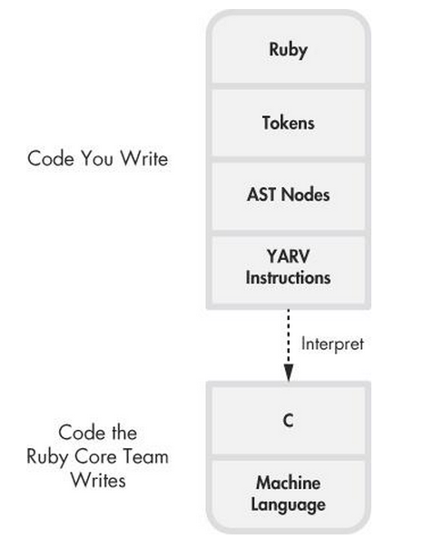

# Crystal vs Ruby

## Goals of Crystal

* Ruby's efficiency for writing code by have nearly the same syntax
* C's efficiency for running code by compiling to efficient native code.

## Why

[fib.rb](fib/fib.rb)
```ruby 
def fib(n)
	if n == 0 || n == 1
		n
	else 
		fib(n-1) + fib(n-2)
	end
end

puts fib(ARGV[0].to_i)
```

[fib.cr](fib/fib.cr)
```crystal 
def fib(n)
	if n == 0 || n == 1
		n
	else 
		fib(n-1) + fib(n-2)
	end
end

puts fib(ARGV[0].to_i)
```

Benchmark of computing the first 30 fibonacci numbers


Benchmark of computing the first 45 fibonacci numbers


Benchmarks done using ruby 2.2.0 and crystal 0.7.5

## Comparison

### Compiler

**Ruby**
* Ruby 1.9 the Yet Another Ruby Virtual Machine (YARV) was introduced
* Code is parsed and then compiled to YARV instructions
* YARV instructions are interpreted to native code
* Written in C



from [*Ruby Under a Microscope*](http://www.amazon.com/Ruby-Under-Microscope-Illustrated-Internals/dp/1593275277)
by Pat Shaughnessy 

**Crystal**
* Compiled directly to native code
* Originally written in Ruby
* Now written in Crystal

### Typing

**Ruby**
Dynamic typing at runtime

**Crystal**
Infered typing at compile time

``` crystal
x = 1 				# x is an Int32

x = if false		# x is an Int32 | String
		1
    else
		"1"
    end
```

Most of the time the type can be inferred except in certain cases

<!--
``` crystal
[] 				# Syntax error: for empty arrays use '[] of ElementType'
[] of Int32			# Empty array that can hold Int32s
[] of (Int32 | String)		# Empty array that can hold both In32s or Strings

{} 				# Syntax error: for empty hashes use '{} of KeyType => ValueType'
{} of String => Int32		
```
-->

### Classes
* Abstract classes

``` crystal
abstract class Fish
  
  	abstract def name
    
 	def type
     	"Fish"
  	end  
end
  
class StingRay < Fish
  
	def name
      "sting ray"
    end   
end
  
x = StingRay.new
puts x.name				# "sting ray"
puts x.type				# "Fish"
Fish.new.type			# can't instantiate abstract class Person:Class
```

* getter, setter, property instead of attr_reader, att_writer, attr_accessor

``` crystal
class Item
  getter id
  property name
  setter size

  def initialize(id, name, size)
    @id = id
    @name = name
    @size = size
  end
end

x = Item.new(1, "name", 2)
x.id
x.name
x.name = "test"
x.size = 1
x.id = 2		# Error
x.size			# Error
```

### Other intersting concepts
* Macros
* Tuples
* C bindings

## Knapsack problem example

[Ruby implementation](knapsack/ruby) 

[Crystal implementation](knapsack/crystal) 

``` ruby
capacity = 6404180
weights = [382745, 799601, 909247, 729069, 467902, 44328, 34610, 698150, 823460, 903959, 853665, 551830, 610856, 670702, 488960, 951111, 323046, 446298, 931161, 31385, 496951, 264724, 224916, 169684]
values = [825594, 1677009, 1676628, 1523970, 943972, 97426, 69666, 1296457, 1679693, 1902996, 1844992, 1049289, 1252836, 1319836, 953277, 2067538, 675367, 853655, 1826027, 65731, 901489, 577243, 466257, 369261]
expected = [1, 1, 0, 1, 1, 1, 0, 0, 0, 1, 1, 0, 1, 0, 0, 1, 0, 0, 0, 0, 0, 1, 1, 1]

# ruby - 186.505 s
# crystal - 99.274 s
```

Benchmarks done using ruby 2.2.0 and crystal 0.7.5

## Additional resources
* Crystal's Github page - [https://github.com/manastech/crystal](https://github.com/manastech/crystal)
* Crystal's api docs - [http://crystal-lang.org/api/](http://crystal-lang.org/api/)
* Crystal libraries and resources - [http://veelenga.github.io/awesome-crystal/](http://veelenga.github.io/awesome-crystal/)
* Knapsack problem data sets - [https://people.sc.fsu.edu/~jburkardt/datasets/knapsack_01/knapsack_01.html](https://people.sc.fsu.edu/~jburkardt/datasets/knapsack_01/knapsack_01.html)
