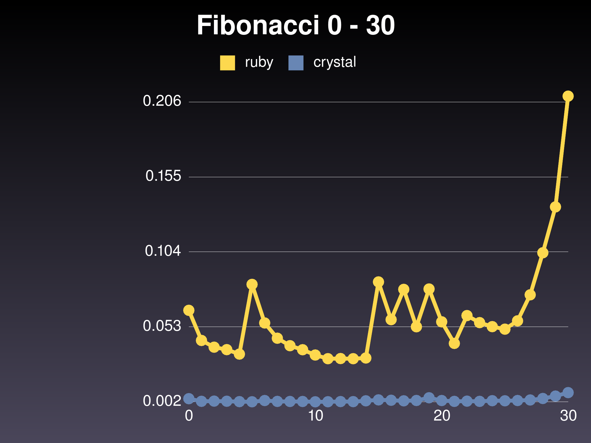
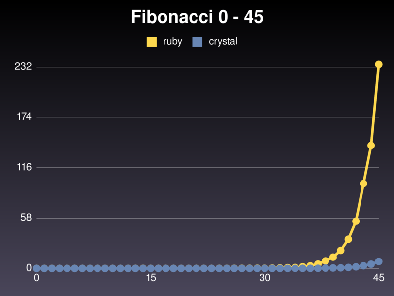

# Crystal vs Ruby

## Basics of Crystal

'' for chars
"" for string

can have relative paths in require
creating arrays
index out of bounds errors
abstract classes


## Why you should be interested

### Simple fibonacci example

[fib.rb](fib/fib.rb)
```ruby 
def fib(n)
	if n == 0 || n == 1
		n
	else 
		fib(n-1) + fib(n-2)
	end
end

puts fib(ARGV[0].to_i)
```

[fib.cr](fib/fib.cr)
```crystal 
def fib(n)
	if n == 0 || n == 1
		n
	else 
		fib(n-1) + fib(n-2)
	end
end

puts fib(ARGV[0].to_i)
```

Benchmark of computing the first 30 fibonacci numbers


Benchmark of computing the first 45 fibonacci numbers


Benchmarks done using ruby 2.2.0 and crystal 0.7.5

## Comparison of the two

## Knapsack problem example

## Resources
* https://github.com/manastech/crystal
* http://veelenga.github.io/awesome-crystal/